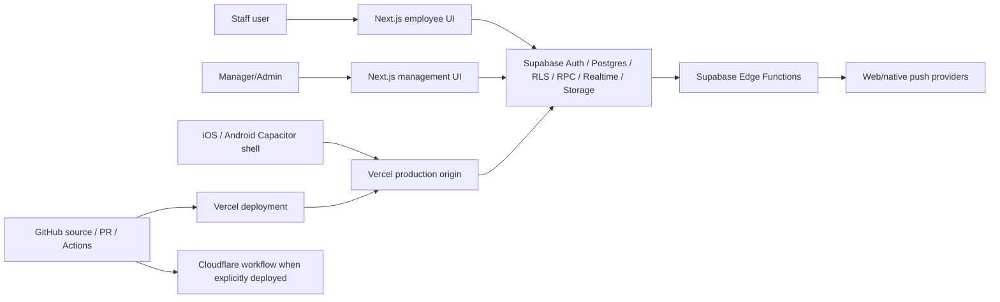
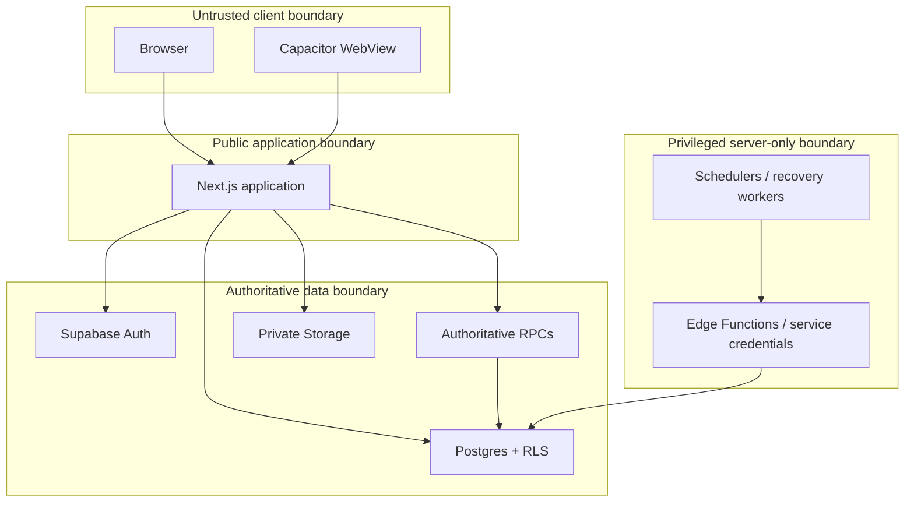

# El Molino Ops — Phase 0 Certification Baseline

Date: 2026-08-18
Baseline/main SHA: `c0edbeaa3f675acb9369857942f4c14d5f4a11d7`
Historical anchor: PR #118 — complete and immutable unless a separately demonstrated defect requires change
Scope of this PR: documentation/evidence only; no product, database, deployment, scheduler, or push behavior changes

## 1. Baseline verification

Live GitHub `main` was inspected before work began. It still points to `c0edbeaa3f675acb9369857942f4c14d5f4a11d7`; no later legitimate commit exists at the time of this baseline.

Current production evidence was independently re-read rather than inferred from prior reports:

- Vercel production deployment `dpl_EJom7FepAU9Z5EcecBtJMkjqQEKc` is `READY`.
- Deployment Git SHA is exactly `c0edbeaa3f675acb9369857942f4c14d5f4a11d7`.
- `https://el-molino-ops.vercel.app/api/health` returned HTTP 200 during this audit.
- Health release SHA matched the exact baseline SHA and all required health checks reported green.
- Vercel runtime-error inspection for the audit window returned no runtime errors.
- Supabase project `asuvgjxdmxizbnjrccsz` is `ACTIVE_HEALTHY`.
- Latest recorded Supabase migration is `20260818231118 push_delivery_recovery_v1`.
- Supabase currently reports no database branches; destructive/adversarial database work therefore has no verified staging branch today.

These observations do not reopen or reinterpret PR #118. They establish the starting point for later work.

## 2. Product boundary now authoritative

The current Staff release is intentionally narrower than earlier parity planning documents.

### Staff released product

Staff is **Scheduling + Communications**.

Released/allowed employee capability families:

- Home
- published personal schedule and shift details
- open shifts / Shift Pool
- schedule requests and history
- time off
- availability
- give-up / coverage
- trades/swaps
- employee-appropriate team information
- messages
- announcements
- notifications and preferences
- account/access/settings
- tutorials
- help/support/problem reports

### Staff unreleased product

These surfaces must not exist from an ordinary employee's perspective until separately released:

- Training
- Time Clock
- Tips / tip pooling
- earnings / wages / payroll
- financial/labor/sales/revenue/cash controls
- Toast integration/setup/status
- inventory
- maintenance administration
- manager analytics
- diagnostics
- backup/recovery administration
- security/system administration
- unfinished operations modules

Underlying Admin/future architecture is preserved. Feature release is not authorization; both gates are required.

## 3. Proven current release-boundary defects

The current employee home directly links to `/employee/training`, `/employee/time-clock`, and `/employee/tips`. Its primary navigation is `Home · Schedule · Requests · Team · More`, while the newly locked staff information architecture is approximately `Home · Schedule · Requests · Messages · More`.

The employee route tree still contains `training`, `time-clock`, and `tips` routes. That is acceptable as preserved future architecture only after a centralized release gate and direct-route protection are installed.

`app/employee-root-redirect.tsx` already blocks management/admin route families and selected shared manager routes, but it does not currently treat unreleased employee-prefixed routes as feature-release-disabled.

Earlier `EMPLOYEE_APP_PARITY_BIBLE.md` explicitly described Training, Time Clock and Tips as employee product capabilities. That historical document therefore cannot remain the authority for **current released Staff visibility**. Phase 1 must reconcile documentation and implementation without deleting the future modules.

## 4. Existing communications — do not build a third system

Two different communication surfaces exist:

1. `/discussions` — legacy location-oriented discussions with direct table CRUD under RLS.
2. `/employee/team` — the newer Staff Team communications implementation using authoritative RPC boundaries.

The newer Team implementation already provides meaningful foundation that must be evolved rather than discarded:

- employee-safe staff directory RPC
- canonical direct-message creation via a sorted pair key and database uniqueness
- member-scoped channel listing
- conversation-level read state/unread calculations
- channel message send RPC
- Manager-on-Duty resolution/start-conversation flow
- employee announcement list
- separate announcement read and acknowledgment operations
- management announcement send
- recipient snapshot rows
- unread-announcement reminder operation

Observed gaps include, at minimum:

- no centralized Staff feature-release source
- legacy `/discussions` remains a separate surface
- message submission idempotency is not yet an explicit client-key/database invariant
- custom-group lifecycle/history not yet established to the new specification
- system-managed Location/Department/Role channel membership policy not yet established to the new specification
- roster/schedule chat based strictly on published schedule snapshots not yet established
- historical access policy for assignment-driven channels not yet defined
- announcement recipient preview and richer targeting require audit/extension
- delivered/viewed/acknowledged evidence model requires completion/audit
- unacknowledged reminder path requires explicit behavior
- mentions, reactions, threads, pins, secure attachments, authorized search, mute/archive and reporting require phased implementation

## 5. Current authorization/security evidence

The browser/native client is treated as untrusted.

Observed positive evidence:

- relevant schedule, notification, discussion, team and announcement tables inspected in `public` have RLS enabled.
- Team channel/member/message tables expose normal employee operations primarily through authenticated `SECURITY DEFINER` RPCs rather than unrestricted direct table access.
- inspected Team RPCs deny `anon` execute and allow authenticated execute.
- direct-message creation validates the authenticated employee/location and canonicalizes the employee pair.
- announcement acknowledgment binds the mutation to the authenticated active employee's own recipient row.
- announcement send snapshots recipients rather than deriving historical counts dynamically.
- recent production migration history contains multiple authorization/integrity hardening migrations.

Unresolved evidence requirements:

- complete human-readable and machine-readable authorization matrix
- exhaustive negative authorization tests for every sensitive write
- table sensitivity inventory
- full threat model and trust-boundary review
- complete SECURITY DEFINER function/grant audit (advisor warnings alone are not treated as proof of vulnerability)
- IDOR/BOLA adversarial suite
- SAST/DAST/secret/supply-chain evidence under the new certification ledger
- independent penetration test (`EXTERNAL EVIDENCE REQUIRED`)

## 6. Scheduling integrity evidence

The repository contains a mature scheduling engine, published-schedule model, Shift Pool/request/trade flows and permanent contract tests. Recent production migrations explicitly hardened schedule request submission, review lock ordering, validation RPCs, employee availability privacy/update behavior, and labor privacy.

This audit does not reinterpret those protections. Remaining certification work must attack them with concurrent, stale-state, duplicate-retry, two-device, randomized/property and authorization-denial tests rather than simplifying the model.

## 7. CI/mobile evidence

Current Web CI on pull requests to `main` includes:

- locked dependency install
- TypeScript checking
- production build plus the repository regression suite
- Cloudflare OpenNext build
- Wrangler dry-run validation
- local workerd `/api/health` smoke testing
- Playwright Chromium and WebKit production acceptance

Current Mobile CI includes:

- Android TypeScript contract verification
- Capacitor synchronization
- Gradle unit test/lint/release bundle build
- iOS Capacitor synchronization
- Swift package resolution
- unsigned iOS simulator release build
- bundled privacy-manifest validation

The native shell loads the HTTPS production web origin by default through Capacitor. Simulator/build evidence is not real-device evidence.

Still missing or not yet proven under the hostile standard:

- independent real-device matrix
- mutation/defect-seed gate on critical logic
- flaky-test detection program
- explicit meaningful coverage thresholds
- full concurrency torture suite
- full accessibility certification
- offline/reconnect golden-journey certification
- broad failure-injection suite
- SBOM/provenance policy evidence

## 8. Observability/recovery evidence

Existing evidence includes exact-SHA health reporting, current Vercel runtime error inspection, structured privacy-reduced client error telemetry helpers, normalized notification infrastructure and the completed #118 bounded push recovery mechanisms.

Do not generalize push recovery evidence into a claim that every domain is equivalently recoverable. Broader support, messaging, scheduling, attachment, deployment and database recovery/failure classes remain to be proven separately.

## 9. System context

The Cloudflare node is intentionally shown as a separate deployment path, not as a claim that the current exact head is deployed there.

## 10. Trust boundaries

Client UI visibility is never an authorization boundary. Staff release gating is an additional product boundary layered above role/RLS enforcement.

## 11. Domain inventory for continuing audit

Evaluate and document actual cohesion/coupling around:

- Identity / employment lifecycle
- Authorization / MFA / role and location scope
- Scheduling / publication / requests / Shift Pool / trades
- Communications
- Notifications / push
- Support / problem reports
- Files / attachments
- Audit
- Admin / operations
- Training (future Staff release; Admin architecture preserved)
- Time Clock (future Staff release; Admin architecture preserved)
- Financial / Toast-dependent domains (Staff-hidden)
- Backup / recovery
- Observability
- AI

No artificial package split is authorized merely to make this list look clean.

## 12. Parallel work ownership

One orchestrator owns integration and merge ordering. Database migrations are serialized.

| Workstream | Write owner/boundary | Read dependencies | Expected output | Merge order |
|---|---|---|---|---|
| Phase 1 Staff boundary | Staff feature config, employee nav/home/route gate, associated tests | current employee routes/i18n/auth guard | one authoritative release source + clean Staff IA | first |
| Security/RLS audit | read-only until a separately scoped security PR | schema/functions/grants/tests | permission matrix + findings + targeted fixes | after Phase 1 when changes affect Staff routes; DB changes serialized |
| Scheduling integrity | scheduling engine/tests/RPC evidence only unless defect proven | schedule schema/functions/tests | invariant catalog + torture harness | independent of UI, but migrations serialized |
| Communications | Team/discussions UI, communications schema/RPCs/tests | Staff release config + role/schedule model | evolutionary communications PRs | after Phase 1 |
| UX/i18n/accessibility | shared Staff UI/i18n/tests | Phase 1/communications surfaces | bilingual/accessibility hardening | with or immediately after owning feature PR |
| Tutorials | tutorial config/state/UI/tests | stable Staff IA and released feature flags | role-aware walkthroughs | after communications/announcements core |
| Support/AI | support schema/UI/triage/GitHub bridge | stable Staff IA, release metadata, diagnostics | graceful non-AI intake + bounded AI enhancement | after tutorials unless dependency evidence changes order |
| Recovery/observability | cross-domain tests/telemetry/runbooks | stable feature contracts | failure injection, alerts, recovery proof | certification phase |

No two workstreams may mutate the same migration, feature-release source, route, or shared critical file simultaneously.

## 13. Dependency plan

1. Merge this documentation-only Phase 0 baseline after exact-head CI.
2. Phase 1: centralized Staff release config + direct-route release guard + HOME/SCHEDULE/REQUESTS/MESSAGES/MORE navigation + remove all unreleased Staff visibility. Preserve Admin/future routes.
3. Phase 2: evolve `/employee/team` communications foundation and define a safe retirement/redirect strategy for legacy `/discussions`; introduce schema changes only after authorization/invariant design.
4. Phase 3: rich communications in bounded PRs (roster/MOD/system channels, then reactions/threads, then private attachments/search/mute/archive as dependencies warrant).
5. Phase 4: announcements targeting/preview/delivery-view-ack/reminders.
6. Phase 5: tutorials after UI targets stabilize.
7. Phase 6: guided support with non-AI graceful path first, then AI triage/duplicate/GitHub bridge with evidence binding.
8. Phase 7: hostile certification expansion across architecture, security, concurrency, mutation, failure/recovery, accessibility, performance and observability.
9. Phase 8: staged pilot. Production maturity score remains time- and evidence-gated.

## 14. Stop conditions active now

The orchestrator must stop rather than improvise when a change risks destructive production data loss, requires an unresolved business policy, lacks safe environment support for destructive validation, creates rollback incompatibility, discovers a Sev-1 security/integrity event, or requires external evidence that does not exist.

Because no Supabase branch/staging database is currently verified, destructive failure-injection or migration-recovery drills must not be run against production.

## 15. Immediate known governance gaps

- `main` is currently not branch-protected according to GitHub branch metadata. This weakens enforcement even though CI exists.
- no independent penetration-test evidence exists in this baseline.
- no independent senior architecture review evidence exists in this baseline.
- no verified 90-day operational history exists; production maturity cannot be 10/10.
- no current tutorial implementation was found by repository search.
- no current Help & Support / Report-a-Problem product matching the new specification was found by repository search.

These are recorded as gaps, not silently converted into implementation claims.

## 16. Phase 0 completion rule

Phase 0 is complete when this baseline and `certification-ledger.json` merge with exact-head required CI green. A documentation merge does not itself improve product behavior; it creates the evidence contract that later implementation must satisfy.
